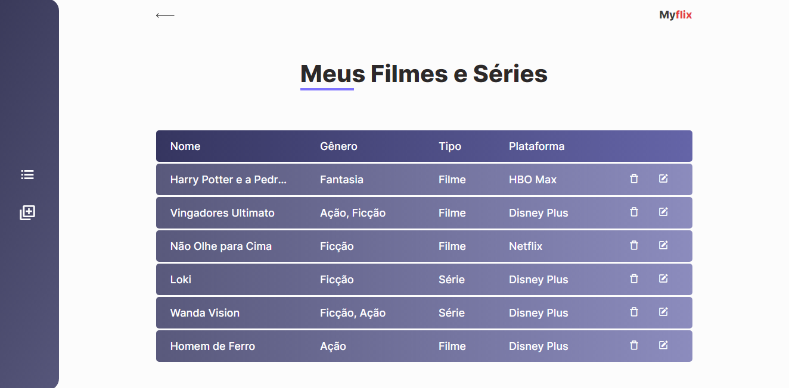
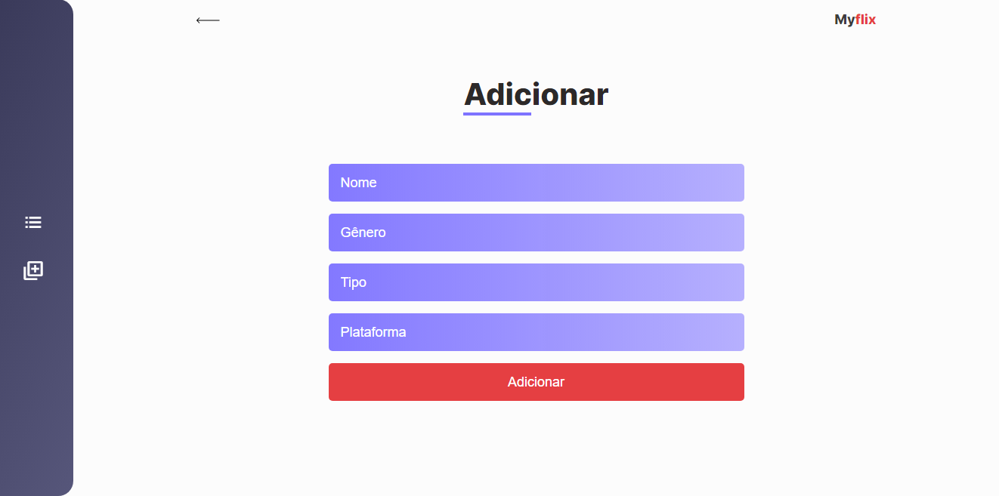
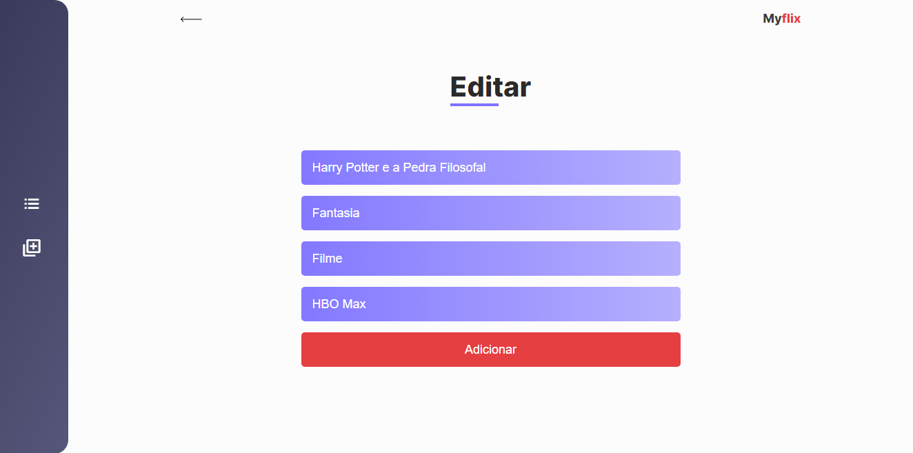
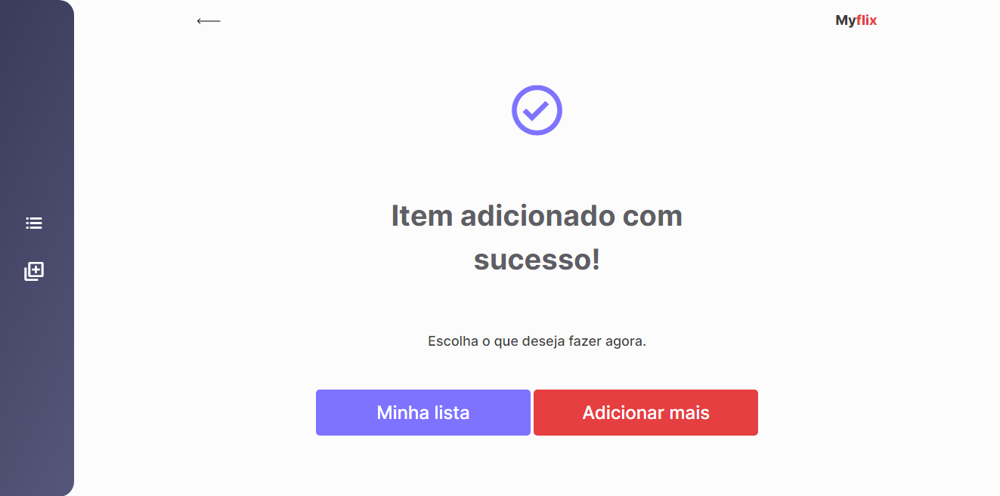
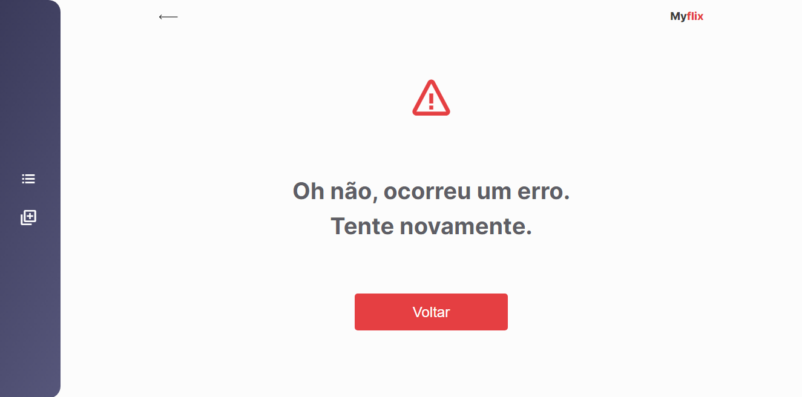

# MyFlix

<div style="display: flex; flex-wrap: wrap; gap: 20px; align-items:center">
    
    
    
    
    
    
</div>

> MyFlix tem como objetivo guardar nomes de filmes ou séries que você deseja ver ou já viu, podendo excluir e editar.

## Técnologias usadas

- JavaScript
- HTML5
- CSS3

## 💻 Pré-requisitos

Antes de começar, verifique se você atendeu aos seguintes requisitos:

- Você possuí o `node` instalado em sua máquina.

## 🚀 Instalando MyFlix

Para instalar o MyFlix, siga estas etapas:

- Crie uma pasta em seu computador
- Em seguida, abra essa pasta em um terminal e digite:

```
git clone https://github.com/MthAbreu/MyFlix.git
```

## ☕ Usando MyFlix

Para usar MyFlix, siga estas etapas:

Execute o seguinte comando em seu terminal para instalar todas as dependencias do projeto:

```
npm install
```

Para rodar o json-server:

```
npm start
```

Abra o arquivo index.html com a extensão live-server do vsCode ou baixe a extensão browser-sync com o seguinte comando:

```
npm install browser-sync
```

Em seguida rode o servidor do browser-sync:

```
npm browser-sync start --server --file . --host --port 5000 --startPath MyFlix/views/index.html
```

Por conta de eu ter usado o json-server, ao executar o projeto, só poderá ser possível vizualizar o design do projeto e a listagem dos itens já cadastrados no "banco". Para ter uma experiência melhor e efetuar todas as funcionalidades do projeto, coloque essa URL nas requisições no diretório service/streamingVideos-service.js:

```
http://localhost:3000/streamingVideos
```

## 📫 Contribuindo para MyFlix

Para contribuir com MyFlix, siga estas etapas:

1. Bifurque este repositório.
2. Crie um branch: `git checkout -b <nome_branch>`.
3. Faça suas alterações e confirme-as: `git commit -m '<mensagem_commit>'`
4. Envie para o branch original: `git push origin <nome_do_projeto> / <local>`
5. Crie a solicitação de pull.

Como alternativa, consulte a documentação do GitHub em [como criar uma solicitação pull](https://help.github.com/en/github/collaborating-with-issues-and-pull-requests/creating-a-pull-request).

[⬆ Voltar ao topo](#MyFlix)<br>
